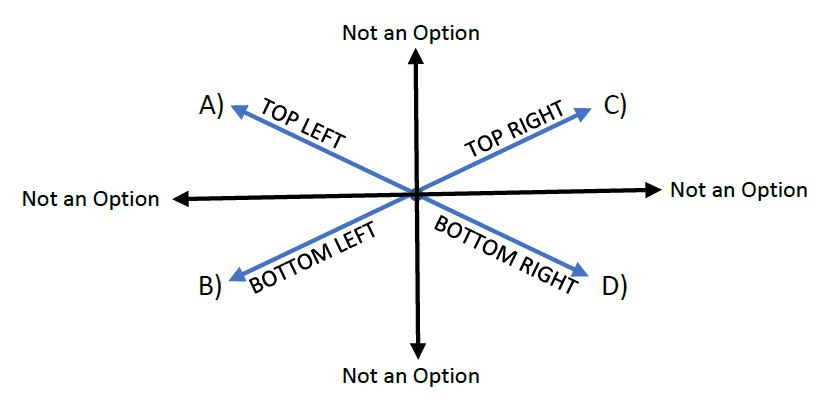
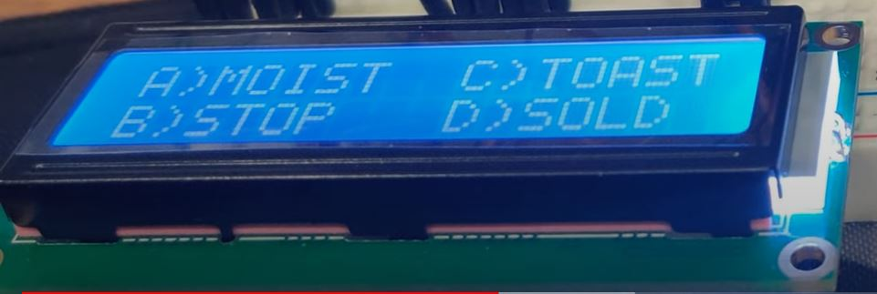

# WordChooser (Creative Game)

    

> The overview circuit board of the WordChooser game.

---

### Table of Contents

- [Description](#description)
- [Demo](#demo)
- [Author Info](#author-info)

---

## Description

This project was designed for guessing words based on the random letters that appear on the screen. From this, users choose which word has all of the letters that show up on the screen and select the word using the joystick. The joystick has 8 inputs, where only 4 options were included due to a small screen size. The image below shows the directions that are available and their corresponding options.

 

The direction of the selections was based off the options/directions seen on the LCD. The image below displays an example of the options shown on the LCD screen. Compared to the image above, we can see that option A) corresponds to TOP LEFT, option B) corresponds with BOTTOM LEFT, option C) corresponds with TOP RIGHT, and option D) corresponds to BOTTOM RIGHT.

 

> The [full code](Code) and [report](File/Barolia_WordChooserReport.pdf), with diagrams and the logic behind the joystick, can be viewed.

A play-through of the full game can be viewed in the Demo Section.

[Back To The Top](#project)

---

## Demo

{:target="_blank"}

[Back To The Top](#project)

---

## Author Info

<h4> Arsalan Barolia</h4>

- LinkedIn - [https://www.linkedin.com/in/arsalanbarolia/](https://www.linkedin.com/in/arsalanbarolia/)
- GitHub - [https://github.com/arsalanbarolia](https://github.com/arsalanbarolia)
- Website - [Enter domain here](enter domain here)

[Back To The Top](#project)

---
